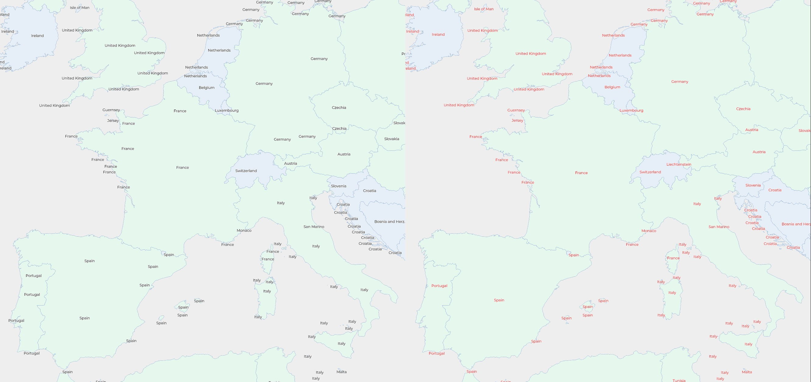

# maplibre-proper-labels

[](https://www.npm.com/package/maplibre-properlabels) [](https://www.jsdelivr.com/package/npm/maplibre-properlabels)

`Maplibre GL JS` plugin for proper labelling of polygons that extend across tiles.



(red labels are the "proper" ones 😅)

## Live example at

https://abelvm.github.io/maplibre-properlabels/example/


## Why

Any tiled-sourced vector layer in MapLibre lacks proper labelling, as every geometry that extends through several tiles has several labels, one per geometry portion.

This just grinds my gears


This is inspired by https://github.com/maplibre/maplibre-tile-spec/issues/710 and my stubbornness

## How to use

### Build

Just grab the files in the `dist` folder, or run `npm run build` to regenerate those files

### Install

Install from npm (recommended):

```bash
npm install maplibre-properlabels
```

Then import in your project:

```javascript
import ProperLabels from 'maplibre-properlabels';
// or, if using CommonJS:
// const ProperLabels = require('maplibre-properlabels').default;
```

Use via CDN (jsDelivr / unpkg):

```html
<!-- jsDelivr -->
<script src="https://cdn.jsdelivr.net/npm/maplibre-properlabels@1.0.0/dist/maplibre-properlabels.js"></script>
<!-- or unpkg -->
<script src="https://unpkg.com/maplibre-properlabels@1.0.0/dist/maplibre-properlabels.js"></script>
```

And then

```javascript
const proper = new ProperLabels({
        map: map,
        source: 'demotiles', 
        sourceLayer: 'countries'
    });
```

When using the CDN bundle the plugin registers itself on `maplibregl.VectorTileSource.prototype` and can also be used like this:

```javascript
const mysource = map.getSource('demotiles');
const proper = mysource.ProperLabels({
        // no need to provide `map` or `source` as they are implicit in `mysource`
        sourceLayer: 'countries'
    });
```

The returned helper is cached on the source. Repeated `mysource.ProperLabels(...)` calls with the same source and equivalent options return the same instance. If you pass different options, the previous instance is disposed and a new one is created.

The returned GeoJSON source also exposes a `dispose()` helper that cleans up the internal worker pipeline, removes the `sourcedata` listener, cancels pending tile processing, clears internal caches, and by default removes the generated auxiliary GeoJSON source from the map.

### Lifecycle

The plugin creates worker pools, subscribes to `sourcedata` events, and keeps internal tile/label caches while active. Call `dispose()` when you remove the proper-labels source, switch styles, or destroy the map instance to avoid worker leakage, stale listeners, and stale cached state.

`dispose()` currently performs the following cleanup:

- shuts down tile and gather worker pools
- cancels pending `postDelay` tile drain scheduling
- clears the tile and label caches
- removes the `sourcedata` event listener
- removes the generated `${sourceId}-proper` GeoJSON source unless `keepSource: true`

Use `keepSource: true` when you want to preserve the generated `${sourceId}-proper` GeoJSON source after disposal:

```javascript
proper.dispose();
```

### Use

Initialize the plugin once the map is ready. The constructor accepts an options object:

| name | type | description | optional | default |
|---|---|---|---|---|
| map | Maplibre Map instance | The map instance | required | — |
| source | string | Vector tile source id, or a `maplibregl.VectorTileSource` instance | required | — |
| sourceLayer | string | The inner layer name inside the vector tiles to label | required | — |
| fid | string | Property name to promote as feature id (promoteId) | optional | `id` |
| tolerance | number | Simplify / polylabel precision (degrees) | optional | `0.00001` |
| units | string | Units for area calculations (`meters` or `m`) | optional | `meters` |
| cacheSize | number | Worker-side cache capacity (entries) | optional | `5000` |
| postDelay | number | Debounce delay in ms for grouped `sourcedata` events | optional | `0` |
| debugLevel | number | Debug verbosity level for PowerLogger output in the worker pipeline (0..3). | optional | `0` |
| keepSource | boolean | Preserve the generated auxiliary GeoJSON source when disposing | optional | `false` |

Example (see `example/index.html`):

```javascript
map.on('load', () => {
    const proper = new ProperLabels({
        map,
        source: 'demotiles',       // can also be a VectorTileSource object
        sourceLayer: 'countries',
        fid: 'fid',                // optional, property used as promoted id
        tolerance: 0.00001,
        units: 'meters',
        cacheSize: 5000,
        postDelay: 50,
        debugLevel: 2,
        keepSource: false
    });

    // The plugin creates a GeoJSON source named `${sourceId}-proper`.
    // Use it when adding a label layer:
    map.addLayer({
        id: 'countries-labels-proper',
        type: 'symbol',
        source: 'demotiles-proper',
        layout: {
            'text-field': ['coalesce', ['get', 'name'], ['get', 'name_en'], ['get', 'NAME'], ''],
            'text-size': 12
        },
        paint: { 'text-color': '#ff0000' }
    });
});
```

## How does it work

I've spent several days trying to put a man in the middle of the lifecycle of the features bucket of MaplibreGL JS, to upstream this functionality, but regardless the approach... the rendered always picked the raw features instead of the processed ones, so, long story short, this is a plugin instead of a PR. And, as a plugin without access to internals, it's not as elegant as it could be. Meh.

And how does it work?

1. On new data loading the plugin queries the vector-tile source for all loaded features using `map.querySourceFeatures(sourceId, { sourceLayer })`.
2. Features are grouped by the promoted id so every logical feature (which may be split across tiles) is processed as a single group.
3. The main thread encodes the groups into a compact transferable payload and posts it to a worker.
4. The worker decodes the payload, runs geometry processing (simplify, union/flatten/combine for multi-part groups, and a safe `polylabel` fallback), and computes a short raw-group signature to detect unchanged items.
5. The worker keeps a cache of processed features and emits incremental diffs (adds/updates/removes) back to the main thread.
6. The main thread reconstructs a canonical `GeoJSONSourceDiff` and applies it with `source.updateData(diff)`.

This design keeps the main thread lightweight by transferring buffers, applying incremental diffs, and avoiding expensive geometry work on the UI thread.

## Local development

To run the example locally:

1. Install dependencies

```bash
npm install
```

2. Start the dev server (Vite serves the example at `/example`)

```bash
npm run dev
# open http://localhost:5173/example/
```

Or build the package and open `example/index.html` after `npm run build`.

## Performance & implementation notes

- The plugin offloads heavy geometry processing to a worker and uses compact binary transferables (Float32 coords + key-indexed properties) to minimize main-thread cost.
- Diffs between runs are encoded as binary transfer messages so `updateData` can be applied with minimal structured-clone overhead.
- Geometry hashing uses a lightweight Float32-based hash with a small deep-equality fallback to avoid unnecessary recomputation.
- For debugging, enable tile boundaries with `map.showTileBoundaries = true` and use the example legend to correlate labels and clipped geometry.

